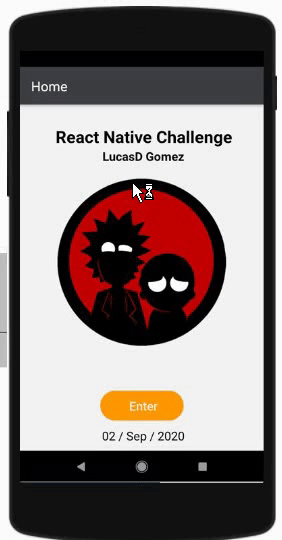
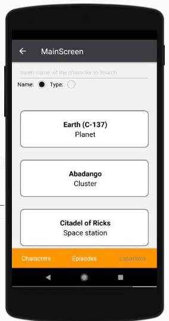

# CHALLENGE REACT NATIVE -  OF RICK & MORTY:
### React Native, Redux, GraphQl, React Pagination

The challenge consists of a web application with 3 searchers, one for the characters, one for locations and one for the episodes. As the user writes in one of the searches, a container has to be filled with data obtained from the API, as personal decision the results are loaded after the page is loaded and then when the user writes in one of the filters the results are filtered.  
The searchers  includes a button to reset the search and the main container.
The search can be done by name or type (in Characters and Locations Pages), which are entity attributes, for this reason, I add an radio input for those properties. 

#### Data is shown in the search:

| Characters | Locations | Episodes |
| ------ | ------ | ------ |
| Name | Name  | Name 
| Image | Dimension | Episode

#### When an user clicks on one item, a modal is shown with detailed information about each entity and show: 

| Characters | Locations | Episodes |
| ------ | ------ | ------ |
| Name | Name  | Name 
| Type | Type | Release Date
| Gender | Dimension | Episode
| Species | Five first Residents | Five first Characters
| Image |  

### Screens: 

  

#### Characters
   

#### Episodes 
   

 #### Locations 
   

### Installation

* To use this project, fork and clone this repository.
* Install all the dependencies I have used with  npm install
* npm start to run The project, or exported in your snack.ip repository
